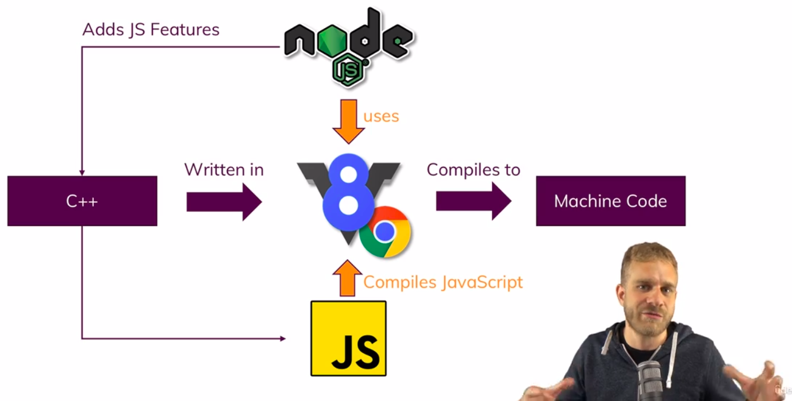
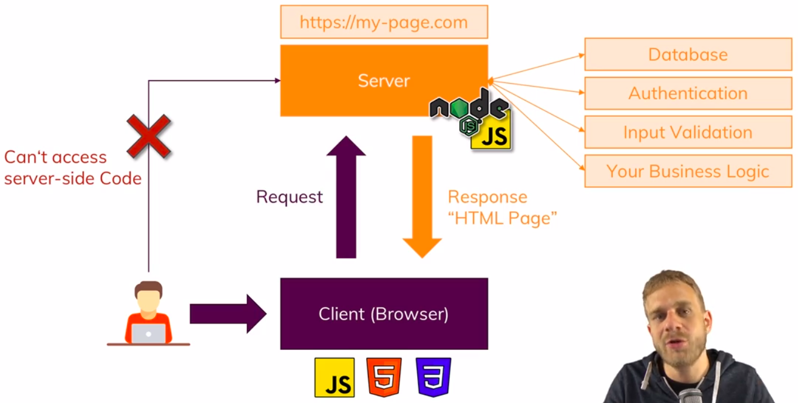
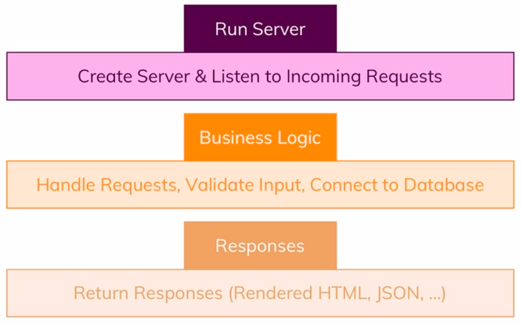
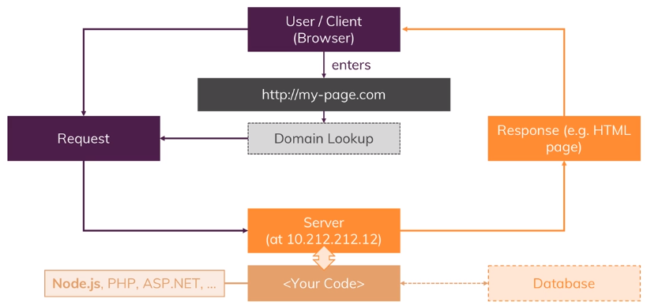
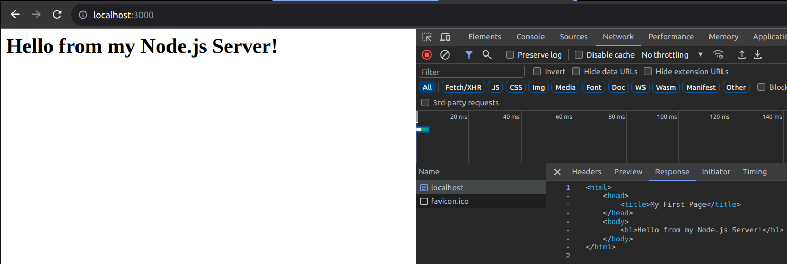
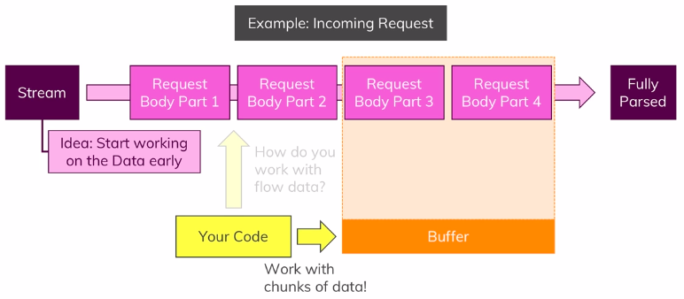

# Node JS

## Basics

- Node JS is a JavaScript runtime
- It allows JavaScript on the server
- Node JS uses V8 engine which is JavaScript engine build by google
- It runs JavaScript in the browser
- V8 engine takes JavaScript code
- And compiles it into machine code



- Node JS runs on the server



- Node JS rule -



## How The Web Works

- The request & response transmission is done through some protocol
- HTTP, HTTPS


- How the web works -



## Creating a Node Server

- Creating a server which executes for every incoming request
- Inside `createServer` function takes two parameters
  - Takes request and
  - Provide response based on that request
- It returns a server which listens for every incoming request

```js
const http = require('http')

// Takes a request and return a response based on that request
const rqListener = (req, res) => {
  console.log(req)
}

// Create a server
const server = http.createServer(rqListener)

// Server listening for every incoming request
server.listen(3000)
```

## The Node Lifecycle and Event Loop

- The core node application is managed by the event loop
- Event loop keeps on running as long as there are event listeners registered
- Node JS uses this pattern as it executes single threaded JavaScript
- Entire node process uses one thread on our computer running on
- Using event loop, the server keep running and executes code when an event occurs

## Understanding Requests

- `req` or this request object is generated with all the data of the incoming request when visiting `http://localhost:3000`
- This object contains functions and data
- Contains `headers` is metadata information
- Some important parameters are `req.url`, `req.method`, `req.headers` shown while hitting `http://localhost:3000` from the browser

```txt
Request URL (http://localhost:3000): /
Request URL (http://localhost:3000/test): /test
Request Method: GET
Request Headers: {
  host: 'localhost:3000',
  connection: 'keep-alive',
  'sec-ch-ua': '"Google Chrome";v="117", "Not;A=Brand";v="8", "Chromium";v="117"',
  'sec-ch-ua-mobile': '?0',
  'sec-ch-ua-platform': '"Linux"',
  'upgrade-insecure-requests': '1',
  'user-agent': 'Mozilla/5.0 (X11; Linux x86_64) AppleWebKit/537.36 (KHTML, like Gecko) Chrome/117.0.0.0 Safari/537.36',
  accept: 'text/html,application/xhtml+xml,application/xml;q=0.9,image/avif,image/webp,image/apng,*/*;q=0.8,application/signed-exchange;v=b3;q=0.7',
  'sec-fetch-site': 'none',
  'sec-fetch-mode': 'navigate',
  'sec-fetch-user': '?1',
  'sec-fetch-dest': 'document',
  'accept-encoding': 'gzip, deflate, br',
  'accept-language': 'en-US,en;q=0.9,bn;q=0.8'
}
```

## Sending Responses

- `res.setHeader()` attachs a header to the response
- Passing some meta information where the type of the context is `html`
- `res.write()` allows to write some data to the response
- `res.end()` sends the response to the client

```js
const http = require('http')

const rqListener = (req, res) => {
  // console.log(req.url, req.method, req.headers)

  res.setHeader('Context-Type', 'text/html')
  res.write('<html>')
  res.write('<head><title>My First Page</title></head>')
  res.write('<body><h1>Hello from my Node.js Server!</h1></body>')
  res.write('</html>')
  res.end()
}

const server = http.createServer(rqListener)

server.listen(3000)
```

- While hitting `http://localhost:3000`, go to network tab in the browser console



## Routing Requests

- creating routing using `req.url`

```js
const http = require('http')

const rqListener = (req, res) => {
  // Creating a routing requests
  if (req.url === '/') {
    res.write('<html>')
    res.write('<head><title>Enter Message</title></head>')
    res.write(
      '<body><form method="POST" action="/message"><input type="text" name="message"><button>Send</button></form></body>'
    )
    res.write('</html>')
    return res.end()
  }

  res.setHeader('Context-Type', 'text/html')
  res.write('<html>')
  res.write('<head><title>My First Page</title></head>')
  res.write('<body><h1>Hello from my Node.js Server!</h1></body>')
  res.write('</html>')
  res.end()
}

const server = http.createServer(rqListener)

server.listen(3000)
```

## Redirecting Requests

- Redirect code - `302`

```js
if (req.url === '/message' && req.method === 'POST') {
  fs.writeFileSync('message.txt', 'DUMMY')
  res.statusCode = 302 // Redirection code
  res.setHeader('Location', '/') // Redirect
  return res.end()
}
```

## Parsing Request Bodies

- Incoming data is basically sent as a stream of data
- Stream is an ongoing process
- The request is read by node in chunks i.e. multiple parts
- In this way, after some time, it's done
- So, theoretically can start working on individual chunks without having to wait for the full request being read
- _Problem:_ Can't arbitrarily try to work with these chunks
- Instead to organize these incoming chunks, use Buffer
- Buffer is a contruct which allows to hold multiple chunks and work with them before they are released once I have done



- `req.on()` listening an event in the Node JS
- The `data` event will be fired whenever a new chunk is ready to be read
  - _1st parameter:_ Name of the event i.e. `data`, `end`, `close`, `error`, `readable`
  - _2nd parameter:_ The function which should be executed for every `data` event
- The `end` event parsing the incoming requests data or the incoming requests in general
- While parsing, rely on the chunks being read in

```js
if (req.url === '/message' && req.method === 'POST') {
  const body = []

  // Data event
  req.on('data', (chunk) => {
    body.push(chunk) // Output: <Buffer 6d 65 73 73 61 67 65 3d 48 65 6c 6c 6f>
  })

  req.on('end', () => {
    // Create a new buffer and add all the chunks
    const parsedBody = Buffer.concat(body).toString() // Output: message=Hello
    const message = parsedBody.split('=')[1] // Output: Hello
    fs.writeFileSync('message.txt', message) // Store in file system
  })

  res.statusCode = 302 // Redirection code
  res.setHeader('Location', '/') // Redirect
  return res.end()
}
```

## Understanding Event Driven Code Execution

- `res.on()` is registering an event listener not execute immediately
- Browser know about that but execute asynchronous style
- So, while registering `res.on()`, the next code may execute
- Next code will be executed asynchronously i.e. don't create blocking

## Blocking and Non-Blocking Code

- So, overall non-blocking code will be like -

```js
const http = require('http')
const fs = require('fs')

const rqListener = (req, res) => {
  if (req.url === '/') {
    res.write('<html>')
    res.write('<head><title>Enter Message</title></head>')
    res.write(
      '<body><form method="POST" action="/message"><input type="text" name="message"><button>Send</button></form></body>'
    )
    res.write('</html>')
    return res.end()
  }

  if (req.url === '/message' && req.method === 'POST') {
    const body = []

    // Data event
    req.on('data', (chunk) => {
      body.push(chunk)
    })

    // Return here so that 'html' page couldn't send as response
    return req.on('end', () => {
      // Create a new buffer and add all the chunks
      const parsedBody = Buffer.concat(body).toString() // message=Hello
      const message = parsedBody.split('=')[1] // Hello

      fs.writeFile('message.txt', message, (err) => {
        res.statusCode = 302 // Redirection code
        res.setHeader('Location', '/') // Redirect
        return res.end()
      })
    })
  }

  res.setHeader('Context-Type', 'text/html')
  res.write('<html>')
  res.write('<head><title>My First Page</title></head>')
  res.write('<body><h1>Hello from my Node.js Server!</h1></body>')
  res.write('</html>')
  res.end()
}

const server = http.createServer(rqListener)

server.listen(3000)
```

## Node.js Looking Behind the Scenes

- 