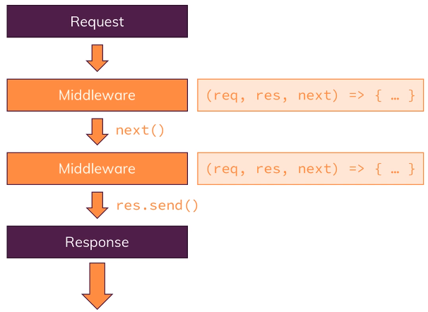

# Table Of Content

- [Table Of Content](#table-of-content)
- [Express JS](#express-js)
  - [Installing `Express.js`](#installing-expressjs)
  - [Adding Middleware](#adding-middleware)
  - [Express.js - Looking Behind the Scenes](#expressjs---looking-behind-the-scenes)
  - [Handling Different Routes](#handling-different-routes)
  - [Parsing Incoming Requests](#parsing-incoming-requests)
  - [Limiting Middleware Execution to `POST` Requests](#limiting-middleware-execution-to-post-requests)
  - [Using Express Router](#using-express-router)
  - [Adding a `404` Error Page](#adding-a-404-error-page)

# Express JS

## Installing `Express.js`

- Install nodemon as a development dependency:

```cmd
npm init -y
npm i --save-dev nodemon
```

- Install `Express.js`:

```cmd
npm i --save express
```

- Use `Express.js`:

```js
const http = require('http')

const express = require('express') // Exports a function
const app = express() // Execute that function

const server = http.createServer(app) // Passing 'app' to create a server
server.listen(3000) // Listen the server at 3000 port
```

- Run the project:

```cmd
npm start
```

## Adding Middleware

- _Middleware:_ An incoming `request` is automatically funneled through a bunch of functions by `Express.js` before sending a `response`



- `app.use()` allow to add a middleware function
- Takes a function (middleware function) as a parameter
- That middleware function is executed for every incoming request
- That middlewre function takes three arguments
  - `req` - Incoming request
  - `res` - Sendable response
  - `next` - function that allows the request to continue to the next middleware

```js
app.use((req, res, next) => {
  console.log('In the middleware!')
  next() // Allows the request to continue to the next middleware in line
})

app.use((req, res, next) => {
  console.log('In another middleware!')
  // next() // If want to continue with the next middleware
  // res.send() // If want to send response & end working with middleware
})
```

- Middleware is working from top to bottom as written in the code

## Express.js - Looking Behind the Scenes

- Now, the structure of the code:

```js
const http = require('http')

const express = require('express')
const app = express()

app.use((req, res, next) => {})
app.use((req, res, next) => {})

const server = http.createServer(app)
server.listen(3000)
```

- But `Express.js` create server & listen to any port together using `app.listen()`

```js
const express = require('express')
const app = express()

app.use((req, res, next) => {})
app.use((req, res, next) => {})
app.listen(3000)
```

## Handling Different Routes

- Using middleware, to control what is getting shown
- Middleware allows to route the requests into different middleware

```js
// URL - http://localhost:3000/
app.use('/', (req, res, next) => {
  console.log('This always runs!')
  next() // Allows the request to continue to the next middleware in line
})

// URL - http://localhost:3000/add-product
app.use('/add-product', (req, res, next) => {
  console.log('In add-product middleware!')
  res.send('<h1>The "Add product" Page!</h1>')
})

// URL - http://localhost:3000/
app.use('/', (req, res, next) => {
  console.log('In another middleware!')
  res.send('<h1>Hello from Express!</h1>')
})
```

## Parsing Incoming Requests

- By default, `request` doesn't parse the incoming request `res.body`
- Need a `body-parser`
- Adding `body-parser` using middleware
- Use before all the route middleware
- Install `body-parser`

```cmd
npm i --save body-parser
```

- It will parse the data inside the `body`

```js
const bodyParser = require('body-parser')

app.use(bodyParser.urlencoded({ extended: false }))

app.use('/add-product', (req, res, next) => {
  res.send(
    '<form action="/product" method="POST"><input type="text" name="title" ><button type="submit">Add Product</button></form>'
  )
})

app.use('/product', (req, res, next) => {
  console.log(req.body) // Output: { title: 'Book' }
  res.redirect('/')
})
```

## Limiting Middleware Execution to `POST` Requests

- `app.use()` hits for both incoming `GET` & `POST` request
- `app.get()` is used for only incoming `GET` request

```js
app.post('/product', (req, res, next) => {
  console.log(req.body)
  res.redirect('/')
})
```

- Why `app.post()`?? will disclose later section

## Using Express Router

- `app.use()` doesn't match the exact matching
- For example, If not handling `http://localhost:3000/example` using middleware but use `app.use` then it will move `http://localhost:3000/`
- `app.get()` or `app.post()` do the exact URL matching
- For example, If not handling `http://localhost:3000/example` using middleware, so because of using `app.use`, it will show error
- `app.use()` - order matters
- `app.get()` or `app.post()` - order doesn't matters
- Express Route in `routes/admin.js`:

```js
const express = require('express')

const router = express.Router()

router.get('/add-product', (req, res, next) => {
  res.send(
    '<form action="/product" method="POST"><input type="text" name="title"><button type="submit">Add Product</button></form>'
  )
})

router.post('/product', (req, res, next) => {
  console.log(req.body)
  res.redirect('/')
})

module.exports = router
```

- Use of express router in `app.js`:

```js
const adminRouters = require('./routes/admin')

app.use(adminRouters)
```

- `app.get('/add-product', (req, res, next) => {})` - while hitting `http://localhost:3000/add-product` and view some content

```js
app.get('/add-product', (req, res, next) => {
  res.send(
    '<form action="/product" method="POST"><input type="text" name="title"><button type="submit">Add Product</button></form>'
  )
})
```

- `app.post('/product', (req, res, next) => {})` - Other route redirects that `http://localhost:3000/product` route while form validation

## Adding a `404` Error Page

- While hitting `http://localhost:3000/prince`, showing `Cannot GET /prince`
- So, need to handle error page using middleware in `app.js`

```js
app.use((req, res, next) => {
  res.status(404).send('<h1>Page not found.</h1>')
})
```

## Filtering Paths

- _Way-01:_ Filter in root level
- In `admin.js` file:

```js
// /admin/add-product => GET
router.get('/admin/add-product', (req, res, next) => {
  res.send(
    '<form action="/admin/add-product" method="POST"><input type="text" name="title"><button type="submit">Add Product</button></form>'
  )
})

// /admin/add-product => POST
router.post('/admin/add-product', (req, res, next) => {
  console.log(req.body)
  res.redirect('/')
})
```

- In `app.js` file:

```js
const adminRouters = require('./routes/admin')

app.use(adminRouters)
```

- _Way-02:_ Filter in top level
- In `admin.js` file,

```js
// /admin/add-product => GET
router.get('/add-product', (req, res, next) => {
  res.send(
    '<form action="/admin/add-product" method="POST"><input type="text" name="title"><button type="submit">Add Product</button></form>'
  )
})

// /admin/add-product => POST
router.post('/add-product', (req, res, next) => {
  console.log(req.body)
  res.redirect('/')
})
```

- In `app.js` file:

```js
const adminRouters = require('./routes/admin')

app.use('/admin', adminRouters)
```
